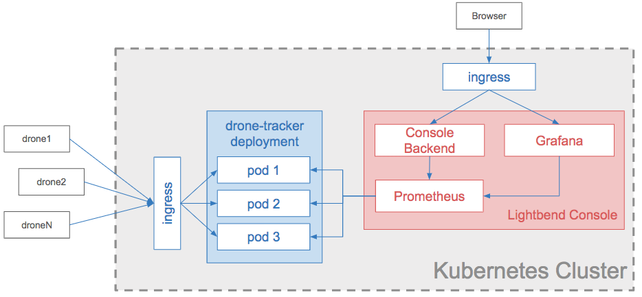
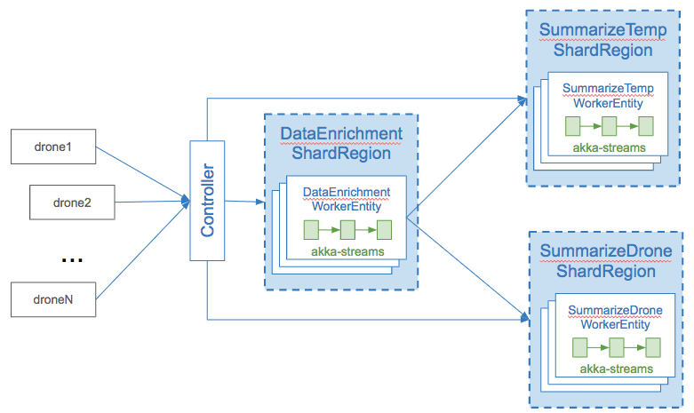
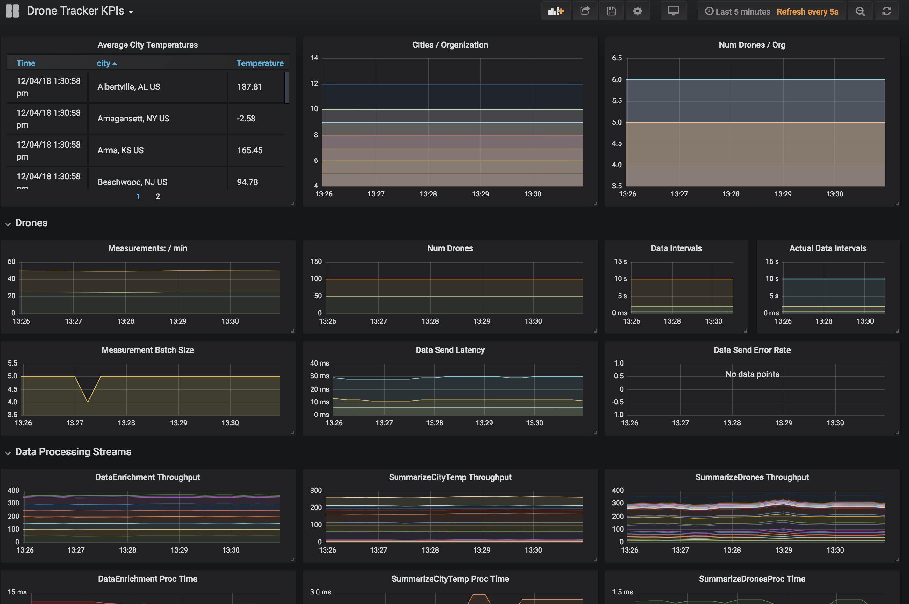
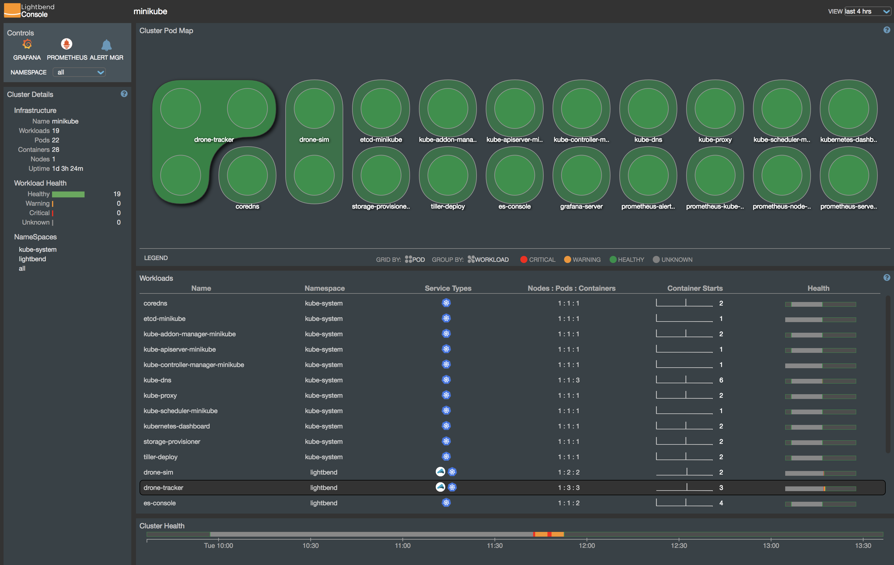

# Drone Tracker App

DroneTrackerApp is a simulated IOT application.  The DroneTracker web service exposes a REST api that drones can send
data to, including temperature and position.  A separate DroneSim application (although within the same codebase)
simulates independent drones flying around with randomized position and temperature.  The DroneTracker process this
data stream using [akka-streams](https://doc.akka.io/docs/akka/current/stream/) in a distributed manner using
[akka-cluster-sharding](https://doc.akka.io/docs/akka/2.5/cluster-sharding.html).
[Akka-management](https://developer.lightbend.com/docs/akka-management/current/index.html) is used for cluster bootstrap
and service discovery.  All this is deployed to [Kubernetes](https://kubernetes.io/) with
[Lightbend Telemetry](https://developer.lightbend.com/docs/telemetry/current/home.html) and
[Lightbend Console](https://developer.lightbend.com/docs/console/current/index.html) providing application visibility.
This application is built using Java/Maven

### Deployment Architecture 

Note that in place of actual drones, a DroneSim application, which is an akka-cluster application simulates the
behavior of drones using actors.  Each drone nonetheless communicates to the DroneTracker application via HTTP

### Application Architecture

The data processing pipeline consists of 3 akka-streams pipelines, parallelized and distributerd using 
akka-cluster-sharding worker entities.  Each pipeline is logically grouped into a shard region.  Finally, the REST
controller provides the ability to query the aggregated state directly from the shard regions.

**Caveats**
- the combination of akka-cluster-sharding with akka-streams for distributed stream processing is an interesting
  architectural pattern, but may or may not be an ideal application architecture depending on your use case.
  Alternative architectures such as using [kafka](https://kafka.apache.org/) or intermediate message brokering and 
  [spark-streaming](https://spark.apache.org/streaming/) for stateful message processing can have some benefits wrt
  decoupling logical pipelines, replaying data, more efficient network bandwidth usage, etc., although at the cost of
  higher operational and network complexity.  Both Kafka and Spark are a part of the
  [Lightbend Fast Data Platform](https://www.lightbend.com/products/fast-data-platform)
- The purpose of this demo application is simply to demonstrate how you can flexibly combine different capabilities of
  the Lightbend Technology Platform for a given use case.

## Installation Instructions

### Prerequisites
- [Maven is installed](https://maven.apache.org/)
- [jdk 1.8 is installed](https://jdk.java.net/8/)
- [Docker is installed](https://www.docker.com/community-edition)
- [minikube running and Lightbend Console installed](https://developer.lightbend.com/docs/console/current/installation/index.html)
- [you have valid Bintray credentials](https://developer.lightbend.com/docs/reactive-platform/2.0/setup/setup-sbt.html#bintray-credentials) 
set up on your dev box

### Installing Custom Metrics Dashboard

DroneTracker comes with a custom Grafana dashboard to display business metrics via
[Lightbend Telemetry](https://developer.lightbend.com/docs/telemetry/current/home.html). To install the the dashboard, 

1. copy the contents of [grafana.json](./grafana.json) to your clipboard
1. open your browser to the Lightbend Console
1. click on the Grafana link in the upper left corner
1. click on the 'Import Dashboard' link in Grafana from the left navigation bar.  Paste the contents of your clipboard 
and click 'Load'

### Building and Deploying the Application

1. initialize your docker environment.  You can do this from the terminal with `eval $(minikube docker-env)`
1. from the terminal, build the application with `mvn package docker:build`
1. deploy the DroneTracker into minikube with `kubectl apply -f drone-tracker.yaml`
1. deploy the DroneSim into minikube with `kubectl apply -f drone-sim.yaml`
1. open up the Lightbend Console with `minikube service expose-es-console --namespace lightbend`

