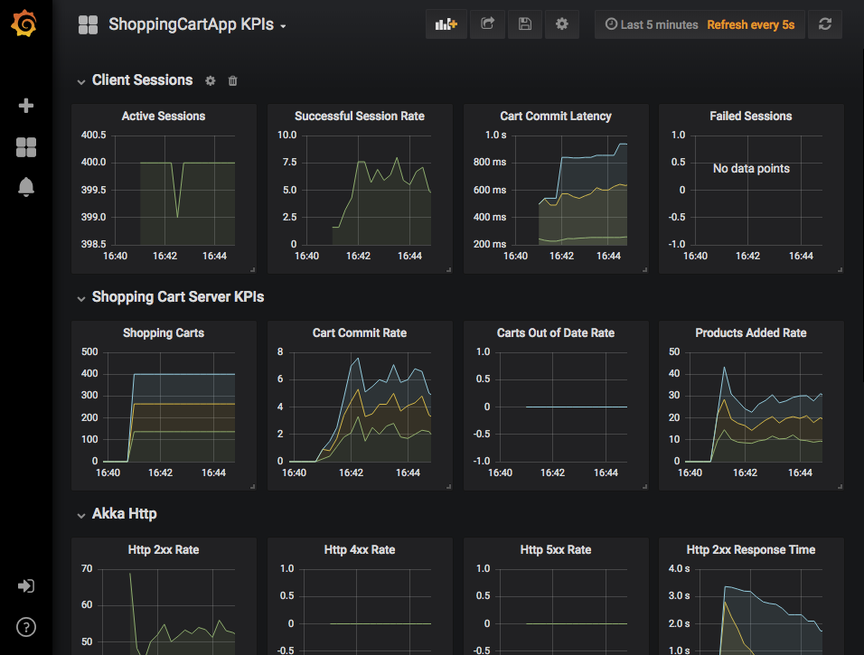
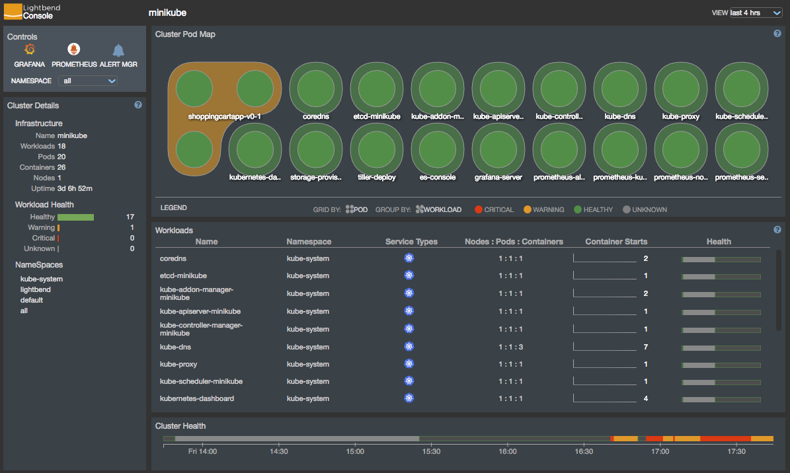
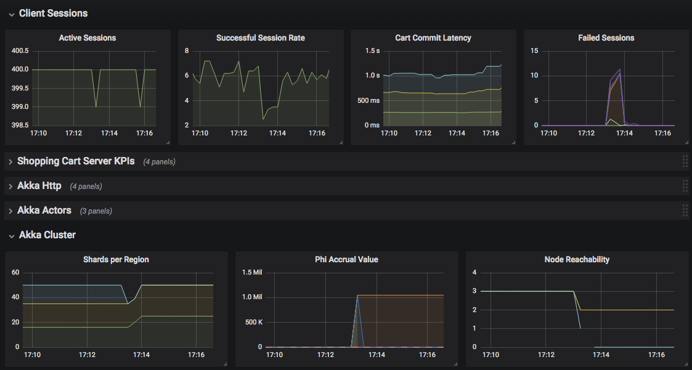
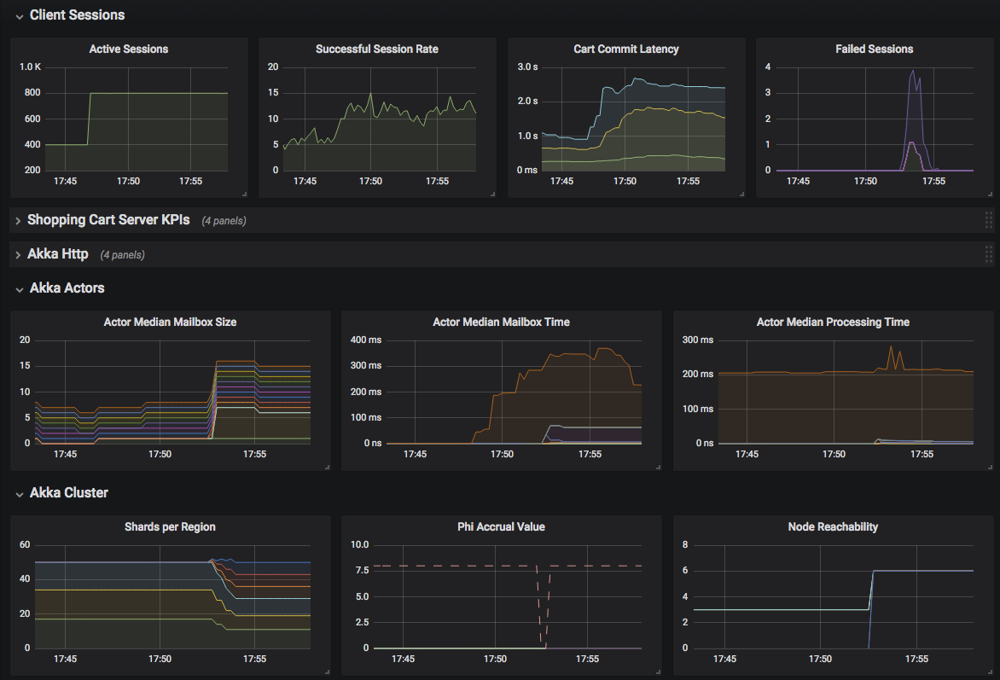

# Shopping Cart App

## Description

ShoppingCartApp is a simulated customer shopping application.  A ShoppingCart web service exposes a REST api, using 
[akka http](https://doc.akka.io/docs/akka-http/current/), that allows users to browse the product catalog, add products 
to cart, query for cart status, and ultimately to commit the cart.  Shopping carts are distributed between the nodes of
the [akka cluster](https://doc.akka.io/docs/akka/current/cluster-usage.html) using 
[akka cluster sharding](https://doc.akka.io/docs/akka/current/cluster-sharding.html). 
[Cinnamon](https://developer.lightbend.com/docs/cinnamon/current/getting-started/start.html) is used to report cluster 
telemetry as well as custom business metrics.  Finally, Enterprise Suite Console is used to monitor the application.  You 
can run the whole setup using [minikube](https://kubernetes.io/docs/setup/minikube/)

**Caveats**
- The above architecure is what a real application deployment might look like. For demo simplicity, we've taken a few
liberties. For instance, the simulated customer sessions are part of the same shoppingcartapp application, and don't
communicate through an ingress, although they still do communicate via HTTP against the primary REST API
- This application does not make use of [akka-persistence](https://doc.akka.io/docs/akka/current/persistence.html) for
the sake of deployment simplicity.  In a real world scenario, it should be used so that when a pod gets restarted or if
data is migrated from one pod to another, akka-persistence would take care of restoring the state of the shopping carts
correctly

## Installation Instructions

### Prerequisites
- [Docker is installed](https://www.docker.com/community-edition)
- [minikube running and Lightbend Console installed](https://developer.lightbend.com/docs/console/current/installation/index.html)
- [you have valid Bintray credentials](https://developer.lightbend.com/docs/reactive-platform/2.0/setup/setup-sbt.html#bintray-credentials) 
set up on your dev box

### Installing Custom Metrics Dashboard

ShoppingCartApp comes with a custom Grafana dashboard to display business metrics via
[Lightbend Telemetry](https://developer.lightbend.com/docs/telemetry/current/home.html). To install the the dashboard, 

1. copy the contents of [grafana.json](./grafana.json) to your clipboard
1. open your browser to the Lightbend Console
1. click on the Grafana link in the upper left corner
1. click on the 'Import Dashboard' link in Grafana from the left navigation bar.  Paste the contents of your clipboard 
and click 'Load'

### Building and Deploying the Application

1. initialize your docker environment.  You can do this from the terminal with `eval $(minikube docker-env)`
1. from the terminal, build the application with `sbt docker:publishLocal`
1. deploy into minikube with `kubectl apply -f shoppingcartapp.yaml`
1. open up the Lightbend Console with `minikube service expose-es-console --namespace lightbend`

## Demo Scenarios

The following are scenarios to exercise to demonstrate various features of the Lightbend Reactive Platform and
Enterprise Suite

### Pod Failover
This scenario demonstrates that the application recovers normally after a pod goes down and gets rescheduled by Kubernetes

1. view the 3 pod new ShoppingCartApp deployment on the console
1. click on the the Grafana link in the upper left control panel
1. select the `ShoppingCartApp KPIs` dashboard from the `Dashboards` dropdown
1. pay attention to the `Shopping Carts` graph.  Note how the shopping carts are evenly distributed amongst the 3 pods
1. from the terminal query for the set of shoppingcartapp pods with `kubectl get pods` and identify one pod with the
prefix `shoppingcartapp-<...>`
1. delete the identified pod with `kubectl delete pod shoppingcartapp-<...>` and wait minikube to reschedule the pod
1. observe the behavior on the dashboard.  Shopping carts that were hosted on the delete pod is migrated over to the
new pod

### Split Brain Recovery

This scenario demonstrates how the SBR module recovers the application from a network partitioned state

1. view the 3 pod new ShoppingCartApp deployment on the console
1. click on the the Grafana link in the upper left control panel
1. select the `ShoppingCartApp KPIs` dashboard from the `Dashboards` dropdown
1. pay attention to the `Shopping Carts` graph.  Note in the `Akka Cluster` section 
    - on the `Shards per Region` graph, the the shopping cart shards are evenly distributed among 3 nodes
    - on the `Node Reachability` graph, every node in the application sees 3 reachable nodes, which means that the
      akka-cluster is in a converged state
1. from the terminal, invoke a partition event by running `python ../bin/network_tool.py -a shoppingcartapp -s 1 split`
1. observe that the resultant changes on the dashboard
    - the `Node Reachability` graph shows that the cluster is bifurcated into a 2 node parition and a 1 node partition 
    - the `Failed Sessions` graph at the top shows session failures.  This is because depending on which side of the
      partition a client reaches, it may or may not see the shopping cart it's looking for

Now let's see what this looks like with [Lighbend's Split Brain Resolver](https://developer.lightbend.com/docs/akka-commercial-addons/current/split-brain-resolver.html) enabled.
  
1. delete the deployment with `kubectl delete -f shoppingcartapp.yaml`
1. edit [minikube-application.conf](./src/main/resources/minikube-application.conf) and uncomment the SBR config section
1. rebuild and redeploy app
1. wait for cluster restart on Grafana dashboard
1. partition the cluster again with `python ../bin/network_tool.py -a shoppingcartapp -s 1 split`
1. observe the resultant changes  
    - the `Node Reachability` graph shows that SBR has taken the minority partition down, in accordance to the configured policy
    - the `Shards per Region` graph shows that the data from the downed partition is migrated to the remaining 2 nodes  
    - the `Failed Sessions` graph shows some transient failure during the partition and recovery events, but goes back to normal soonafter

### Scaling Up and Rebalancing

This scenario showcases akka-cluster's ability to dynamically scale out to handle by rebalancing cluster state

First deploy and observer the steady state of the application

1. view the 3 pod new ShoppingCartApp deployment on the console
1. click on the the Grafana link in the upper left control panel
1. select the `ShoppingCartApp KPIs` dashboard from the `Dashboards` dropdown
1. note that the `Active Sessions` graph shows 400 active client sessions while the applicaiton is in steady state

Now, we are going to double the load on the server and observer the results.  Will will do this by hitting a special api
that will scale up the number of client sessions

1. from the terminal query for the set of shoppingcartapp pods with `kubectl get pods` and identify one pod with the
prefix `shoppingcartapp-<...>`
1. create a port forward to the identified pod with `kubectl port-forward shoppingcartapp-<...> 9975:9975`
1. on a separate terminal, invoke the api to scale up the customer sessions `curl -v  -X POST  'http://0.0.0.0:9975/client-sessions/scale?numSessions=800'`
1. observe the resultant changes on the dashboard
    - the `Active Sessions` graph jumps from 400 to 800
    - the `Actor Median Mailbox Time` graph begins to rise.  This is because one particular actor, the `TransactionAuthenticator`
      can't keep up with the incoming rate of requests.  Over time this will crash the application, not to mention 
      severeley impact customer experience

Let's leverage Kubernetes to fix this quickly by scaling up the application from 3 pods to 6

1. scale up the cluster with `kubectl scale --current-replicas=3 --replicas=6 deployment/shoppingcartapp-v0-1`
1. observe the resultant changes
    - the `Node Reachability` graphs goes from 3 to 6, indicated that the application has been scaled to 6 nodes
    - the `Shards per Region` graphs shows that the data is rebalanced amongst the 6 nodes, so that every node can serve traffic
    - the `Actor Median Mailbox Time` graph flattens out and starts to recover, because there is now enough capacity to
      serve the incoming request rate

